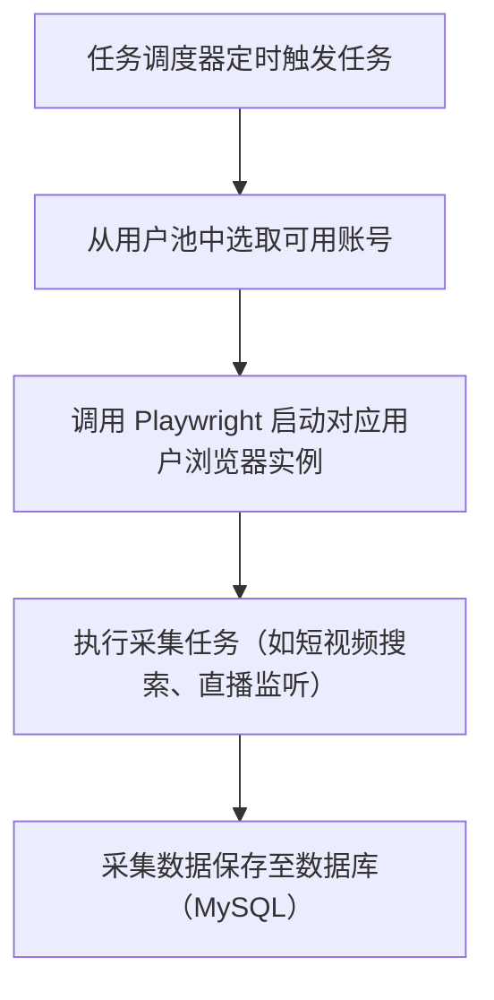
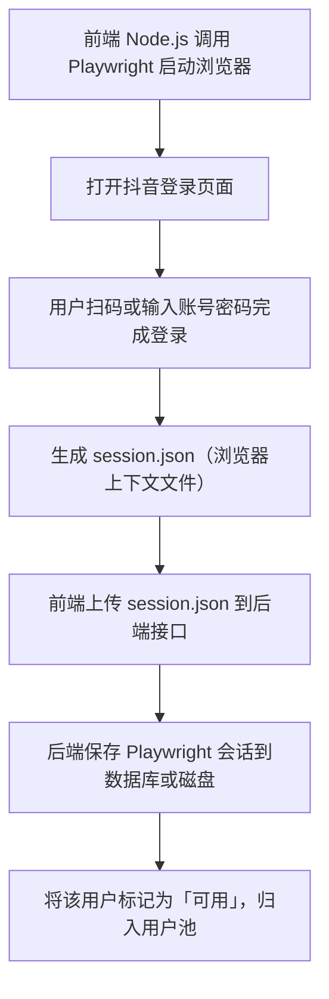

# Caesar Admin

Caesar Admin 是一个基于 **Vue3 + Vite + TypeScript** 构建的现代化后台管理系统模板，并集成 **Electron** 实现跨平台桌面应用打包。项目集成了任务管理、用户授权管理、直播间控制等模块，适用于多平台数据采集、弹幕监控与运营工具开发。

---

## 🔁 Caesar-Media 核心流程图（用户登录与数据采集）

<div style="display: flex; gap: 20px;">

<div style="flex: 1;">
<details>
<summary>🧩 后端流程</summary>


</details>
</div>

<div style="flex: 1;">
<details>
<summary>🖥️ 前端流程</summary>


</details>
</div>
</div>


## 📌 项目简介

- **项目名称**：`caesar-crawler`
- **主要用途**：后台管理界面 + 桌面应用程序
- **核心特点**：
  - 现代前端架构：Vue3 + Vite + TypeScript
  - 跨平台支持：Electron 打包为桌面应用
  - 多账户授权管理：Playwright 模拟登录
  - 多任务调度与爬取：支持短视频内容抓取
  - 弹幕监控：接入直播间弹幕与录制控制
  - 工程规范完善：Git 提交、代码格式、类型校验等全流程支持
  - 服务端地址：[caesar](https://github.com/TyresePeng/caesar)


---

## 💡 技术栈

| 类别       | 技术/工具               | 版本        |
|------------|--------------------------|-------------|
| 前端框架   | Vue                      | ^3.4.29     |
| 构建工具   | Vite                     | ^5.3.1      |
| 类型系统   | TypeScript               | ^5.4.5      |
| 状态管理   | Pinia                    | ^2.1.7      |
| UI 框架    | Element Plus             | ^2.7.5      |
| HTTP 请求  | Axios                    | ^1.7.2      |
| 桌面应用   | Electron                 | ^36.3.2     |
| 打包工具   | Electron Builder         | ^26.0.12    |
| 爬虫框架   | Playwright（Node 支持） | 自定义集成 |

---

## 🧩 功能模块

### 1. 用户池管理

- 利用 Playwright 打开第三方平台登录页
- 用户扫码后自动保存登录状态（如 cookies、storage）
- 登录信息以 Playwright 文件形式保存至后端
- 多用户集中管理，支持任务调度调用

### 2. 任务工作台（短视频采集）

- 自定义任务配置：关键词、平台、页数、爬取频率等
- 支持批量执行、任务状态追踪、历史结果查看
- 后台统一调度 Playwright 启动浏览器并采集短视频数据

### 3. 直播间控制台

- **实时弹幕展示**：展示直播间弹幕、互动内容
- **AI 回复模拟**（功能预留，暂未实现）
- **录制控制**：支持开始/停止录制直播视频，自动保存为 MP4
---
## 🚀 快速安装（适用于普通用户）

如果你只是想**快速使用桌面应用**，无需环境配置，直接下载安装即可：

### 🖥️ macOS 安装包（Apple 芯片M1/M2/M3）

🔗 [点击下载 caesar-media-1.0.0-arm64.dmg](https://github.com/TyresePeng/caesar-admin/releases/download/v1.0.0/caesar-media-1.0.0-arm64.dmg)

- 支持 macOS Apple Silicon (M1/M2/M3) 系列
- 下载后双击安装即可使用
### ⚠️ 安装后需确保后端服务已启动，否则部分功能将不可用
- 服务端地址：[caesar](https://github.com/TyresePeng/caesar)
---

## ✅ 开发者模式启动（适用于开发调试）

如果你是开发者，可以通过以下命令运行开发环境：

```bash
# 克隆项目
git clone https://github.com/TyresePeng/caesar-admin.git

# 进入项目目录
cd caesar-admin

#安装playwright环境
npx playwright install

# 安装 pnpm（如未安装）
npm install -g pnpm

# 安装依赖
pnpm install

# 启动前端开发服务
pnpm dev

# 启动 Electron 桌面应用（开发模式）
pnpm electron:dev
---

## 📦 打包与工程规范

本项目集成了完整的工程化方案与桌面应用构建能力，确保开发流程稳定高效，产物跨平台可用。

### 🛠️ 打包桌面应用

```bash
# 安装 playwright 环境
PLAYWRIGHT_BROWSERS_PATH=0 npx playwright install
# 使用 Electron Builder 打包桌面应用（支持 Mac/Windows/Linux）
pnpm electron:build
```

> 构建产物将在 `dist_app/` 目录中生成。

### 🧪 工程规范配置

- ✅ **统一代码风格**：使用 ESLint + Prettier + Stylelint
- ✅ **Git 提交规范**：Husky + Commitlint + Commitizen
- ✅ **提交前自动格式化**：lint-staged + prettier
- ✅ **TypeScript 严格类型检查**：全面 tsconfig 设置
- ✅ **统一编辑器配置**：`.editorconfig` 保持多开发者一致风格
- ✅ **目录结构清晰**：支持多模块拆分与懒加载

---

## 📝 注意事项

- 修改 `.env.development` 中的 `VITE_MOCK_DEV_SERVER` 可切换是否启用 Mock 数据
- 若需连接本地后端，设置 `VITE_APP_API_URL=http://localhost:8989`
- 若组件类型提示报错，尝试重启 VSCode 或执行 `pnpm install` 修复依赖
- Electron 调试日志详见 `logs/` 目录

---

## 📚 参考文档

- [Vue3 + Vite + TS 后台管理系统搭建](https://blog.csdn.net/u013737132/article/details/130191394)
- [Git 提交规范指南](https://blog.csdn.net/u013737132/article/details/130191363)
- [Playwright 官方文档](https://playwright.dev/)
- [Electron 官方指南](https://www.electronjs.org/docs)

---

## 📌 TODO（后续规划）

- [ ] AI 自动弹幕回复集成（ChatGPT）
- [ ] 任务类型支持：短视频自动批量发布、短视频评论采集
- [ ] 多平台支持（抖音、快手、B站等）
---

## 📬 联系方式

如有需求要，请联系：

> **开发者**：Tyrese
> **邮箱**：tyrese.guo@gmail.com
> **项目地址**：[GitHub](https://github.com/TyresePeng/caesar-admin)

### 🧑‍💻 微信交流群
扫码添加开发者微信，备注 “Caesar”，邀请进交流群 👇
<table>
  <tr>
    <td style="text-align:center;">
      <br/>
      <strong>微信群二维码</strong>
    </td>
    <td style="text-align:center; padding-left: 20px;">
      <br/>
      <strong>作者微信</strong>
    </td>
  </tr>
</table>